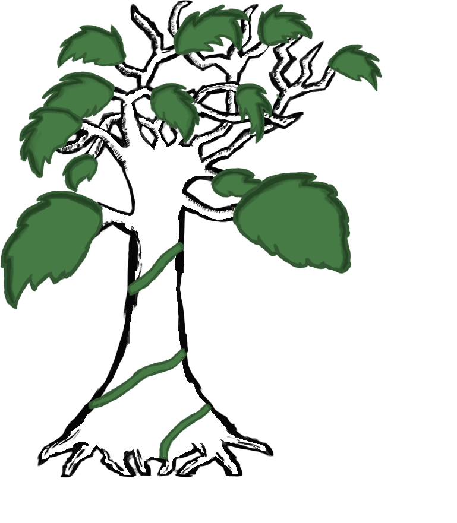

<h1 align="center">Proyecto FP</h1>
<p align="center">
  
</p>

<h2 align="center">Proyecto FP - <a href='https://demo.treedlink.com'>demo.treedlink.com</a></h2>

Aplicación web realizada el TFM (trabajo fin de grado) de DAW (desarrollo de aplicaciones web) en el curso 2025-2026.

## Descripción

YourTree es una red social que permite a los usuarios crear perfiles públicos y compartir enlaces a sus redes sociales, sitios web y otros recursos. Además, cuenta con un sistema de foros donde se puede debatir sobre diversos temas.

## Tecnologías

- **Frontend:** React y Vite.
- **Backend:** Node.js y Express.
- **Base de datos:** PostgreSQL.

## Instalación

```bash
# Clonar el repositorio
git clone <url-del-repositorio>

# Instalar dependencias del frontend
cd frontend
npm install
npm run dev

# Instalar dependencias del backend
cd ../backend
npm install
npm run dev


```

## .env

El archivo .env es un archivo de configuración que se utiliza para almacenar variables de entorno. Estas variables son utilizadas por la aplicación para configurar su comportamiento.

El archivo .env se encuentra en la carpeta backend/ y tiene el siguiente contenido:

```env
PORT=3000
DB_HOST=localhost
DB_PORT=5432
DB_USER=postgres
DB_PASSWORD=postgres
DB_NAME=yourtree
JWT_SECRET=secret
``` 
